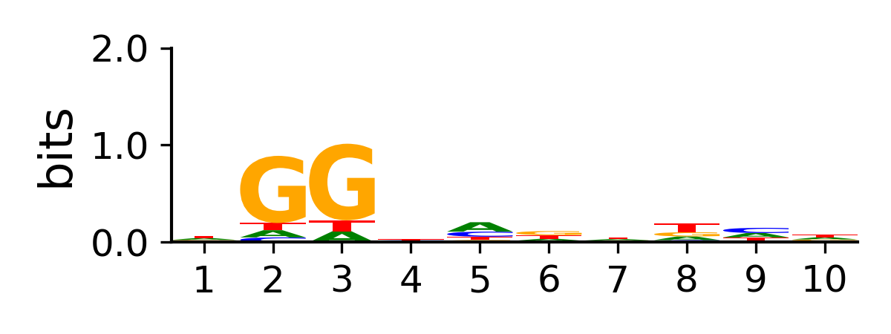

[![CC BY-NC-ND 4.0][cc-by-nc-nd-shield]][cc-by-nc-nd]

# PAMpredict

A package to predict protospacer adjactent motifs (PAMs) of Cas proteins.

## Installation

```sh
conda create -n PAMpredict -c conda-forge -c bioconda python=3 argparse biopython pandas numpy scipy logomaker blast pysam mafft muscle=5.1 samtools matplotlib sed
git clone https://github.com/Matteo-Ciciani/PAMpredict
conda activate PAMpredict
cd PAMpredict
PAMpredict/PAMpredict.py -h
```
### Phage Databases

PAMpredict can run on any database of phage genomes in fasta format. We recommend using [GPD](https://doi.org/10.1016/j.cell.2021.01.029) and [MGV](https://doi.org/10.1038/s41564-021-00928-6). To download them:
```sh
# Gut Phage Databases (GPD)
wget http://ftp.ebi.ac.uk/pub/databases/metagenomics/genome_sets/gut_phage_database/GPD_sequences.fa.gz
gunzip GPD_sequences.fa.gz
# Metagenomic Gut Virus catalogue (MGV)
wget https://portal.nersc.gov/MGV/MGV_v1.0_2021_07_08/mgv_contigs.fna
```
## Usage

PAMpredict is desigend to search for conserved nucleotides near putative protospacers, using a list of CRISPR spacers as input. The input spacers must be in fasta format and have to be in the same orientation (i.e. they come from the same CRISPR array or from arrays in the same orientation). A blastn database must be built for each phage genome database prior to running the analysis (see Example run).

### Example run

The example provided shows how to predict the PAM of SpCas9. First, build the blastn database:
```sh
# run this in the PAMpredict directory
conda activate PAMpredict
makeblastdb -in Example/Phages/phages.fna -dbtype nucl -parse_seqids
```

Then run the prediction with:
```sh
PAMpredict/PAMpredict.py Example/spacers.fna Example/Phages Example/outdir
```

Resulting in a PAM identified downstream of the putative protospacers.

<!---

--->


### Parameter list

-t, --threads: Number of parallel processes [default:1].

--keep_tmp: Keep temporary files.

--log_lvl: Logging level (DEBUG,INFO,WARNING,ERROR) [default:INFO].

--force: Overwrites existing results if present.

-d, --max_diff: Maximum number of differences (gaps + mismatches) allowed between spacers and putative protospacers [default:4].

-p, --pam_position: PAM position with repsect to spacers, default is DOWNSTREAM (e.g. for Cas9), can be changed to UPSTREAM (e.g. for Cas12).

-f, --format: File format of the PAM plot (png,ps,eps,svg,pdf) [default:png].

-l, --pam_length: Number of PAM positions used to generate predictions and plot [default:10].

--no_plot: Suppress plot generation.

### Output
* **arguments.tsv**: list of arguments used.
* **unique_spacers.fna**: fasta file containing unique spacer sequences.
* **spacer_alignment_stats.tsv**: table containing the number of mapped spacers for each database and the number of mathces for each spacer.
* **consensus_flanking_sequences.tsv**: table containing upstream and downstream consensus flanking sequences computed for each mapped spacer.
* **upstream_flanking_sequence_info.tsv**: table containing the information for each base computed in the upstream flanking sequence.
* **downstream_flanking_sequence_info.tsv**: table containing the information for each base computed in the downstream flanking sequence.
* **upstream_flanking_sequence.png**: plot of the information in the upstream flanking sequence.
* **downstream_flanking_sequence.png**: plot of the information in the downstream flanking sequence.
* **PAM_prediction.txt**: This file is generated only if the predcition if successful. It reports the position in which the PAM was found, an approxiamtion of the PAM as a sequence (e.g. NGG) and the inferred orientation of CRISPR spacers used as input.

##### If run with `--keep_tmp` the following is also produced:

* **blastn/blastout_\*.tsv**: raw blast output for each phage database.
* **blastn/\*_filtered_matches_with_flanking_sequences.tsv**: filtered blast matches and relative flanking sequences for each phage database.
* **realignment/\*_to_realign.fna**: flanking regions to realign for each spacer.
* **realignment/\*_aligned.fna**: aligned flanking regions for each spacer.

[cc-by-nc-nd]: http://creativecommons.org/licenses/by-nc-nd/4.0/
[cc-by-nc-nd-image]: https://licensebuttons.net/l/by-nc-nd/4.0/88x31.png
[cc-by-nc-nd-shield]: https://img.shields.io/badge/License-CC%20BY--NC--ND%204.0-lightgrey.svg
